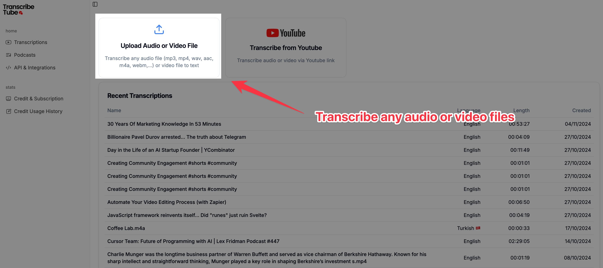
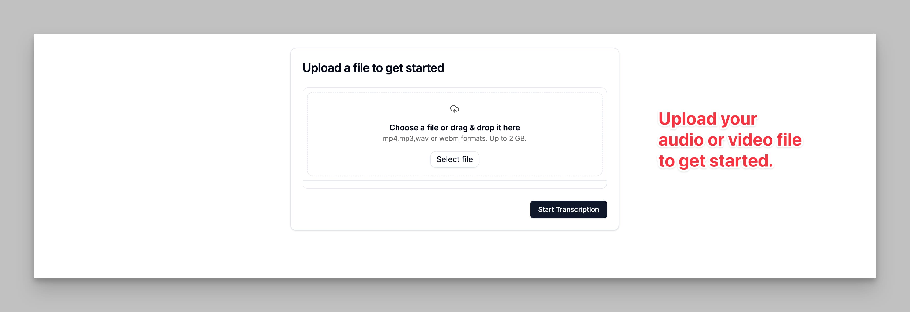

<Frame caption="Caption Text">
  
</Frame>
## Step 1: Navigate to the Dashboard
- Go to the **TranscribeTube Dashboard**.
- You’ll see options to upload your audio or video file directly or transcribe from a YouTube link.
- **Click on the "Upload Audio or Video"** button to start the process.

---

<Frame caption="Caption Text">
  
</Frame>
## Step 2: Upload Your File
- On the upload screen, **select the audio or video file** you wish to transcribe. Supported formats include `mp3`, `mp4`, `wav`, `aac`, `m4a`, and `webm`.
- **Drag and drop the file** into the upload area or click on "Select File" to browse from your device.
- Once the file is selected, **click on "Start Transcription"** to initiate the process.
- TranscribeTube supports files up to **2 GB** in size.

<Frame caption="Caption Text">
  
</Frame>
## Step 3: Edit Your Transcription
- Once the transcription is complete, it will open in the **transcription editor**.
- You can see details like the **language**, **video length**, and **speaker identification**.
- Low-confidence words will be highlighted, allowing you to **review and correct** any parts of the transcription that might need adjustments.
- You can **edit the transcript** while listening to the audio to ensure accuracy, then click **"Save Changes"** once you’re done.

---
<Frame caption="Caption Text">
  
</Frame>
## Step 4: Download Your Transcription
- After editing, you can **download the transcription** in your preferred format.
- **Click "Download Transcription"**, and choose between `.txt` (text document) or `.srt` (subtitle) formats.
- This makes it easy to use the transcription for various purposes, such as creating captions or storing notes.

