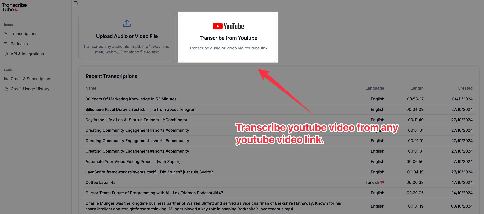
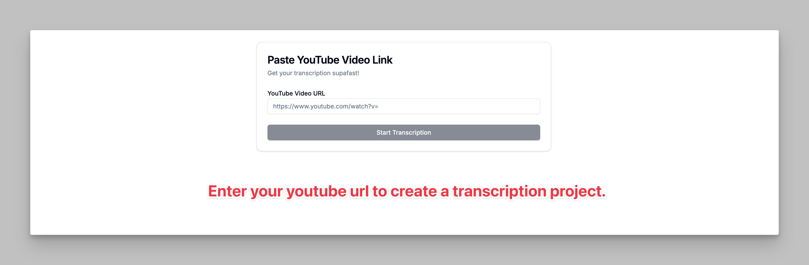
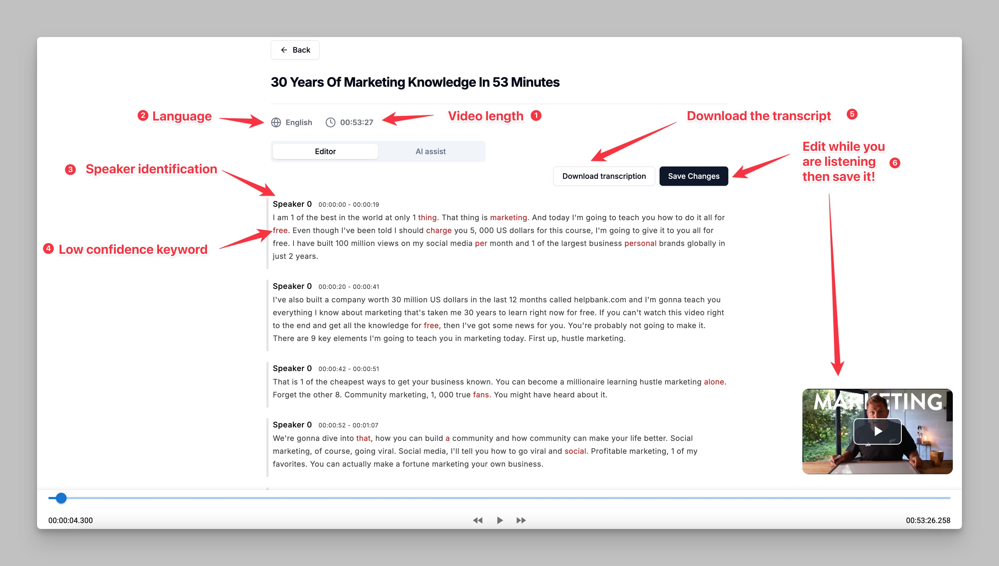
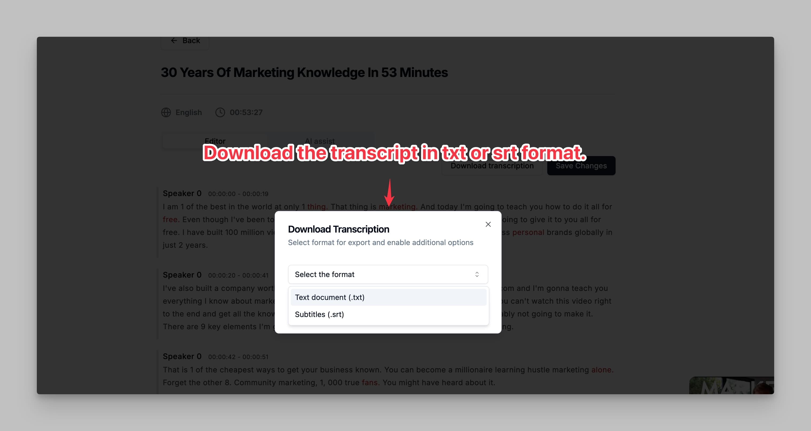

<Steps>
  <Step title="Step 1: Navigate to the Dashboard">
    <Frame caption="Go to the TranscribeTube Dashboard and click 'Transcribe from YouTube' to start.">
      
    </Frame>
    - Go to the **TranscribeTube Dashboard**.
    - You’ll see an option labeled **Transcribe from YouTube**.
    - **Click on "Transcribe from YouTube"** to proceed with YouTube video transcription.
  </Step>

  <Step title="Step 2: Enter YouTube Video Link">
    <Frame caption="Paste the YouTube video link and start the transcription process.">
      
    </Frame>
    - A prompt will appear asking for the **YouTube Video URL**.
    - Copy the URL of the YouTube video you want to transcribe.
    - **Paste the URL** into the provided field.
    - Once the link is entered, click on **"Start Transcription"** to begin.
  </Step>

  <Step title="Step 3: Edit Your Transcription">
    <Frame caption="Use the editor to review and make adjustments to your transcription.">
      
    </Frame>
    - After transcription completes, it will open in the **transcription editor**.
    - You can see details like **language**, **video length**, and **speaker identification**.
    - Low-confidence words are highlighted, allowing you to **review and correct** any parts that need adjustments.
    - **Edit the transcript** while listening to the audio to ensure accuracy, then click **"Save Changes"** when finished.
  </Step>

  <Step title="Step 4: Download Your Transcription">
    <Frame caption="Download the transcription in .txt or .srt format for easy use.">
      
    </Frame>
    - Once you’ve finished editing, you can **download the transcription** in your preferred format.
    - Click on **"Download Transcription"** and choose between `.txt` (text document) or `.srt` (subtitle) formats.
    - This makes it easy to use the transcription for captions, notes, or other purposes.
  </Step>
</Steps>