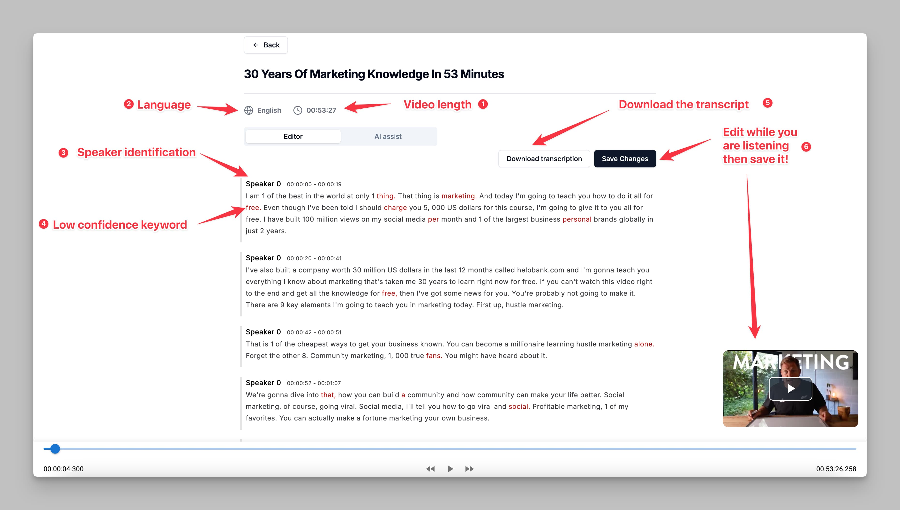

The **Transcription Text Editor** provides a user-friendly interface to review, edit, and refine your transcriptions. Each feature in the editor is designed to make the transcription process smoother and more accurate. Here’s a breakdown of each numbered feature:

<Frame caption="Transcription Editor Interface">
  
</Frame>

## 1. Video Length
- Displays the total length of the video being transcribed.
- This information helps you understand the duration of the content and track your progress as you edit the transcription.

## 2. Language
- Displays the language of the transcription. This information is useful if you are working with multiple languages and need confirmation of the transcription language.

## 3. Speaker Identification
- The editor uses speaker labels (e.g., "Speaker 0") to distinguish different speakers in the transcription.
- This feature helps organize the text by identifying changes in speakers, making the dialogue clearer and easier to follow.

## 4. Low Confidence Keywords
- Certain words or phrases may be highlighted as **low-confidence keywords**. These words are marked when the transcription software is uncertain of their accuracy.
- You can review these keywords and correct them as needed to ensure a precise transcription.

## 5. Download Transcription
- Once you have reviewed and edited the transcription, you can click on **Download Transcription**.
- The download options include `.txt` (text document) and `.srt` (subtitle) formats, allowing flexibility based on your needs.

## 6. Edit and Save the Transcription while Listening to the Audio
- The editor allows you to make changes to the transcription text directly while listening to the audio.
- Once edits are complete, click **Save Changes** to preserve your modifications.

